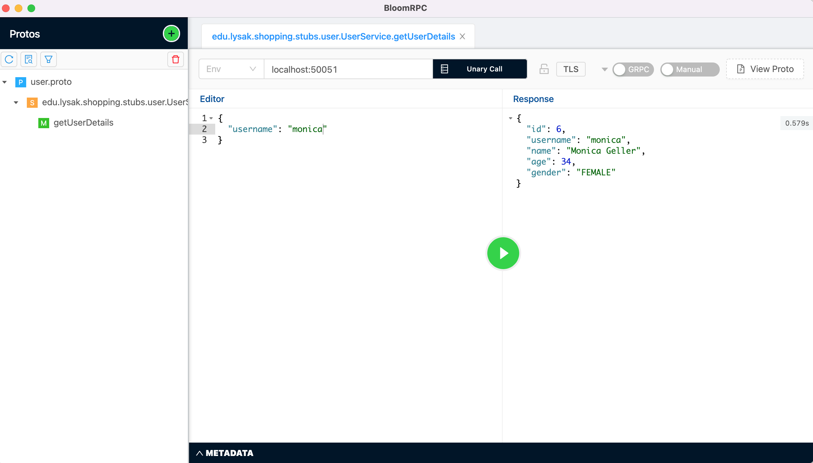

# grpc-learning-project
Project for learning gRPC with LinkedIn Learning course https://www.linkedin.com/learning/building-java-microservices-with-grpc


### Prerequisites:
Install GUI Client for GRPC Services for testing requests
```
brew install --cask bloomrpc
```
<br>

